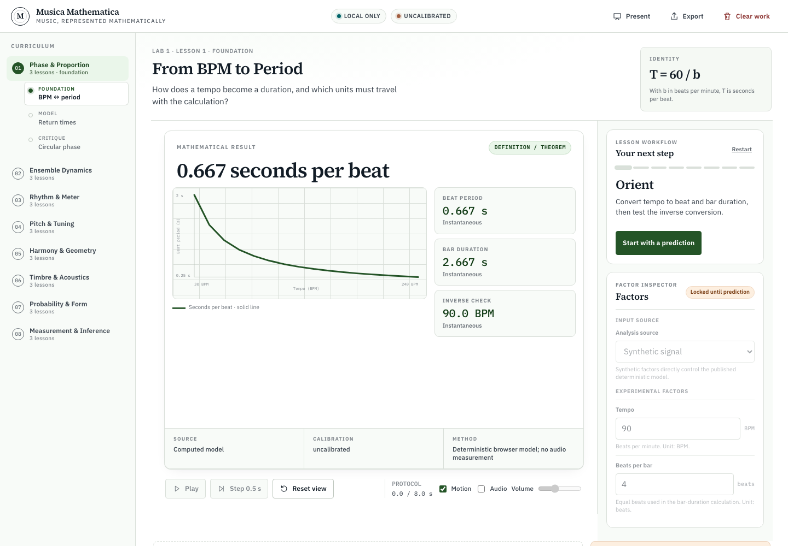
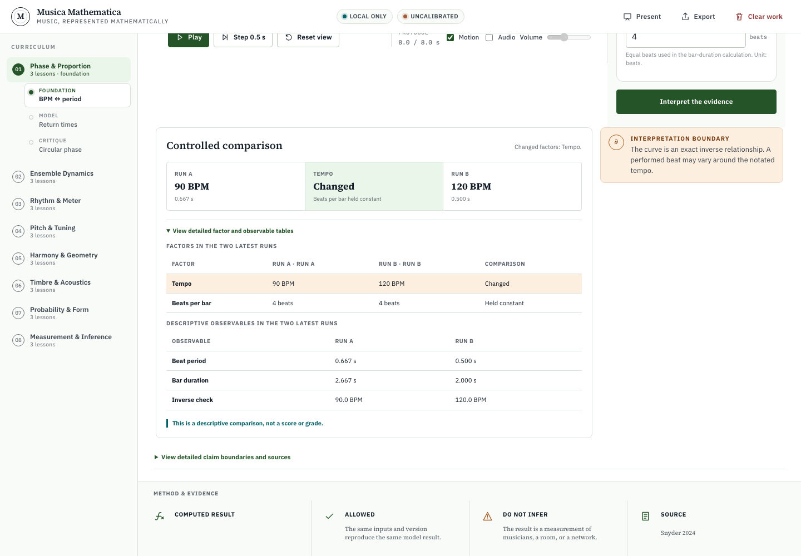

# Musica Mathematica

Musica Mathematica is a browser application for teaching mathematical
representations of music. It contains 24 lessons across eight domains, a local
learning portfolio, deterministic lesson evaluators, and optional local audio
analysis.

The application is an alpha teaching workbench. It is not a calibrated
instrument, transcription system, learning-management system, gradebook, or
validated assessment. Results describe the selected mathematical model or one
bounded audio segment. They do not assess a performer or establish a perceptual
or pedagogical claim.

## Scope

Each domain contains a foundation lesson, a model lesson, and a critique lesson:

| Domain | Foundation | Model | Critique |
| --- | --- | --- | --- |
| Phase & Proportion | From BPM to Period | Polyrhythm Return Times | Phase on the Circle |
| Ensemble Dynamics | Lock-In and Order | Delay, Jitter, and Topology | External Pulse or Peer Adaptation |
| Rhythm & Meter | Cycles and Euclidean Rhythm | Autocorrelation, Spectrum, and Meter | Recorded-Onset Hypotheses |
| Pitch & Tuning | Ratios, Logs, and Cents | Temperaments and Commas | Timbre Changes Consonance |
| Harmony & Geometry | Pitch-Class Symmetry | Tonnetz and Voice-Leading | Chord Hypotheses |
| Timbre & Acoustics | Resonance, Modes, and Partials | Fourier, Windows, and Aliasing | Time-Varying Timbre |
| Probability & Form | Seeded Chance | Markov Memory | Entropy, Surprisal, and Form |
| Measurement & Inference | Provenance and Uncertainty | Recovering Parameters | Compare Without Grading |

All lessons use the same inquiry sequence: orient, predict, experiment,
compare, explain, perform, transfer, and debrief. The
[curriculum guide](docs/MUSICA_MATHEMATICA_CURRICULUM.md) documents lesson
content and teaching boundaries.

## Current capabilities

- Deterministic evaluators for phase, ensemble dynamics, rhythm, tuning,
  harmony, acoustics, probability, and measurement examples.
- Hash routes in the form
  `#/labs/<domain-id>/lessons/<lesson-id>`.
- Browser-local portfolio persistence, JSON export, and explicit clearing.
- At most 12 stored trials per lesson and 256 trace points per trial.
- Claim labels for identities, model results, observations, transcription
  hypotheses, literature context, heuristics, and recommendations.
- Optional microphone and file analysis in Recorded-Onset Hypotheses, Chord
  Hypotheses, and Time-Varying Timbre.
- Synthetic input for every lesson.
- Presentation mode for projected use.

## Limitations

- There is no backend, account, roster, remote storage, LMS integration, course
  authoring, gradebook, or automatic assessment.
- Portfolio persistence is limited to one browser origin. The application
  continues in memory if `localStorage` is unavailable.
- Portfolio export is download-only. The application does not import or restore
  exported portfolio JSON.
- Audio results are uncalibrated and device-dependent. dBFS is not SPL, browser
  latency settings are not end-to-end measurements, and ranked labels are
  hypotheses.
- Pitch estimation is monophonic. Tempo, meter, onset, and chord estimates can
  be ambiguous or incorrect.
- Automated browser tests cover Chromium only. Firefox, Safari, hardware
  microphones, and platform codec behavior have not been verified.
- No formal accessibility conformance or classroom-effectiveness claim has
  been established.
- Only the implemented version 1 to version 2 portfolio migration is supported.
- The repository is `UNLICENSED`.

See [SCIENTIFIC_AUDIT.md](SCIENTIFIC_AUDIT.md) for the implemented model,
evidence categories, and prohibited inferences.

## Requirements

- Node.js `^20.19.0` or `>=22.12.0`
- pnpm `11.6.0`
- A browser with JavaScript modules
- Browser `localStorage` for persistence
- Playwright Chromium for `pnpm test:e2e` and `pnpm verify`

Microphone input also requires a secure browser context, user permission,
`getUserMedia`, `AudioWorklet`, and Web Worker support. Loopback development
addresses are treated as secure contexts by current browsers.

## Installation

Install the locked dependencies:

```sh
pnpm install --frozen-lockfile
```

Install Playwright Chromium if it is not already available:

```sh
pnpm exec playwright install chromium
```

On Linux systems that do not already have Chromium's system libraries, use:

```sh
pnpm exec playwright install --with-deps chromium
```

## Configuration

The application has no runtime environment variables, environment file, API
key, database, or external service configuration.

`pnpm dev` binds Vite to `127.0.0.1`. The application stores version 2 portfolio
data under `musicaMathematica.learning.v2`. When no valid version 2 record
exists, it can copy a valid `ensembleCouplingLab.learning.v1` record into the
corresponding Ensemble Dynamics lesson. The migration keeps the version 1
record and marks migrated trials with a legacy protocol identifier.

The Content Security Policy is defined in [index.html](index.html). It permits
same-origin application resources and loopback WebSocket connections used by
the development server.

## Usage

Start the development server:

```sh
pnpm dev
```

Open <http://127.0.0.1:5173/>.

For a typical lesson:

1. Select a domain and lesson.
2. Review the question, factors, equation, evidence labels, and source notes.
3. Save a prediction.
4. Record two trials, changing only the intended factor.
5. Compare the latest two trials.
6. Complete the explanation, performance, transfer, and debrief stages.
7. Export the portfolio or clear local work from the header.

Microphone capture is limited to 5 through 20 seconds. Audio files must use an
`audio/*` media type, be no larger than 25 MiB, decode to no more than 90
seconds, and use an analysis range no longer than 30 seconds. Raw audio, file
names, and device identifiers are not stored in the portfolio or its export.
See [docs/LOCAL_AUDIO_METHOD.md](docs/LOCAL_AUDIO_METHOD.md) for the processing
path and interpretation limits.

## Interface





The screenshots are 1440 by 1000 Chromium captures produced by
`scripts/capture-readme-screenshots.mjs`. See
[docs/SCREENSHOTS.md](docs/SCREENSHOTS.md) before replacing them.

## Repository structure

| Path | Purpose |
| --- | --- |
| `src/main.tsx` | Browser entry point |
| `src/App.tsx` | Routes, portfolio state, export, clearing, and presentation mode |
| `src/components/workbench/` | Curriculum and lesson interface |
| `src/labs/` | Lesson catalog, domain models, and evaluator dispatch |
| `src/simulation/` | Delayed ensemble model and compatibility surfaces |
| `src/audio/` | Input validation, worklet, worker, features, and hypotheses |
| `src/learning/` | Inquiry stages, comparison, evidence, portfolio, and migration |
| `src/styles/` | Application stylesheets |
| `src/**/*.test.ts(x)` | Colocated Vitest unit and component tests |
| `tests/e2e/` | Playwright browser workflows and scenario helpers |
| `scripts/` | Maintainer scripts |
| `public/` | Static assets copied into the build |
| `docs/` | Architecture, curriculum, audio, and screenshot documentation |
| `.github/workflows/` | Continuous-integration workflow |
| `package.json` and `pnpm-lock.yaml` | Package metadata, scripts, and locked dependencies |
| `vite.config.ts` and `playwright.config.ts` | Build, unit-test, and browser-test configuration |
| `tsconfig.json` and `eslint.config.mjs` | TypeScript and lint configuration |

## Development workflow

1. Install dependencies with the frozen lockfile.
2. Make a focused change.
3. Add or update tests for changed behavior.
4. Run the narrowest relevant check.
5. Run `pnpm verify` before proposing the change.

Available commands:

| Command | Purpose |
| --- | --- |
| `pnpm dev` | Start Vite on `127.0.0.1:5173`. |
| `pnpm lint` | Run ESLint over `src` and `tests`. |
| `pnpm typecheck` | Run TypeScript without emitting files. |
| `pnpm test` | Run the Vitest suite through the unit-test alias. |
| `pnpm test:unit` | Run the Vitest unit and component suite. |
| `pnpm build` | Type-check and create the static bundle in `dist/`. |
| `pnpm test:e2e` | Run the Playwright Chromium workflows. |
| `pnpm verify` | Run lint, typecheck, unit tests, build, and end-to-end tests. |
| `pnpm audit --prod` | Query the package registry for production dependency advisories. |

## Testing

Vitest covers deterministic models, portfolio validation and migration, audio
contracts, worker coordination, and component output. Playwright covers route
navigation, inquiry completion, local persistence, export, clearing, legacy
migration, storage failure, reduced motion, audio failure reporting, and a small
viewport.

The GitHub Actions workflow installs dependencies from the lockfile, installs
Chromium with Linux system dependencies, and runs `pnpm verify` on Node 22.

## Deployment and operation

Create the static bundle:

```sh
pnpm build
```

Deploy the contents of `dist/` to an HTTPS static host at the origin root. The
current build uses root-relative asset paths such as `/assets/` and `/fonts/`;
subpath deployment is not configured. Lesson navigation uses URL fragments, so
the host does not need a route fallback beyond serving the root `index.html`.

The repository does not contain a server process, container configuration,
hosting manifest, deployment command, or rollback procedure. A deployment must
provide its own cache policy and HTTP security headers. The HTML meta Content
Security Policy is not a substitute for response headers.

## Troubleshooting

### Playwright cannot find Chromium

Run:

```sh
pnpm exec playwright install chromium
```

Linux CI installs browser system dependencies with
`pnpm exec playwright install --with-deps chromium`.

### Microphone input is unavailable

Confirm that the page is in a secure context, permission is granted, and the
browser supports `getUserMedia`, `AudioWorklet`, and Web Workers. Synthetic mode
does not require microphone access.

### An audio file is rejected

Check the media type, encoded size, browser codec support, decoded duration, and
selected range. An `audio/*` media type does not guarantee codec support.

### Portfolio changes are not persisted

The application reports storage failure and continues in memory. Export the
portfolio before leaving the page. Clearing browser site data removes records
that were not exported.

### Port 5173 is unavailable

Stop the process using the port or use Vite's displayed fallback URL. The
Playwright suite uses strict port `4174` and fails if that port is occupied.

## Security considerations

The application processes learner text and optional audio in the browser.
Review [SECURITY.md](SECURITY.md) for reporting instructions and trust
boundaries. Do not place secrets in client code or environment files. Treat
portfolio exports as user data.

## Contributing

See [CONTRIBUTING.md](CONTRIBUTING.md) for test expectations, compatibility
surfaces, documentation requirements, and pull-request guidance.

## License

No project license has been selected. Runtime dependency and font attribution
is documented in [THIRD_PARTY_NOTICES.md](THIRD_PARTY_NOTICES.md), and the
production bundle includes `public/third-party-licenses.txt`.
