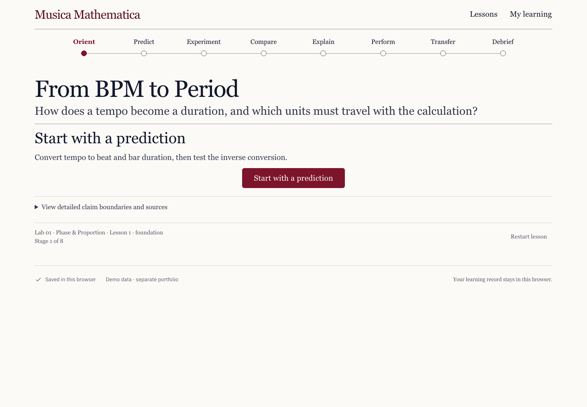
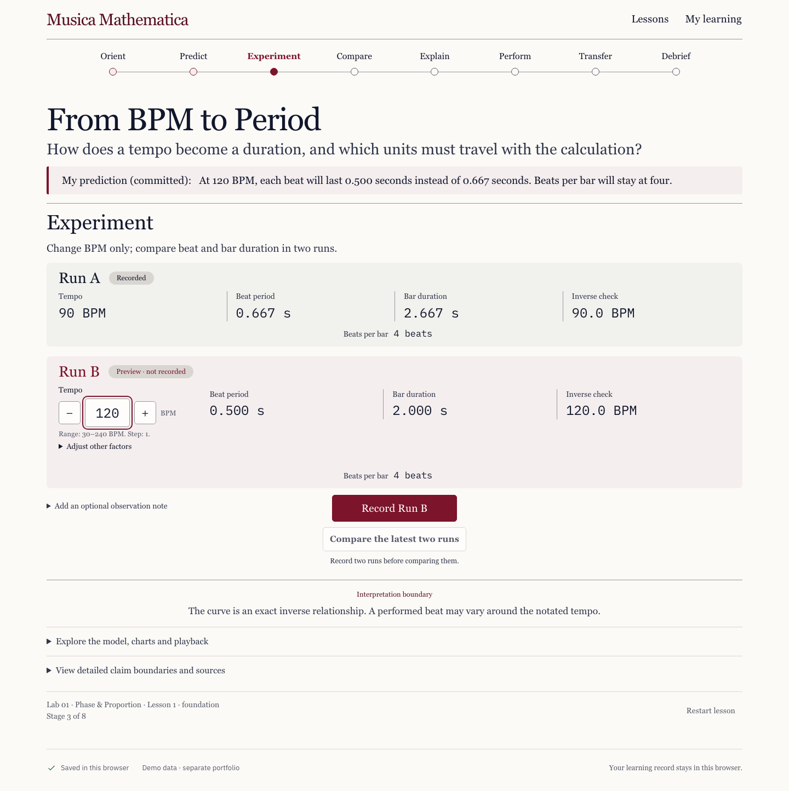
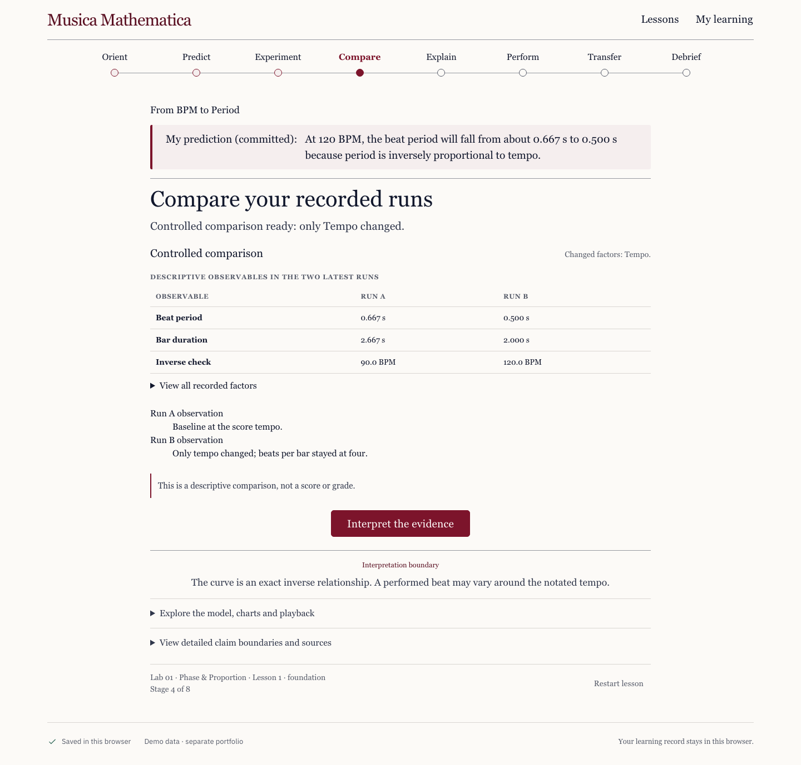
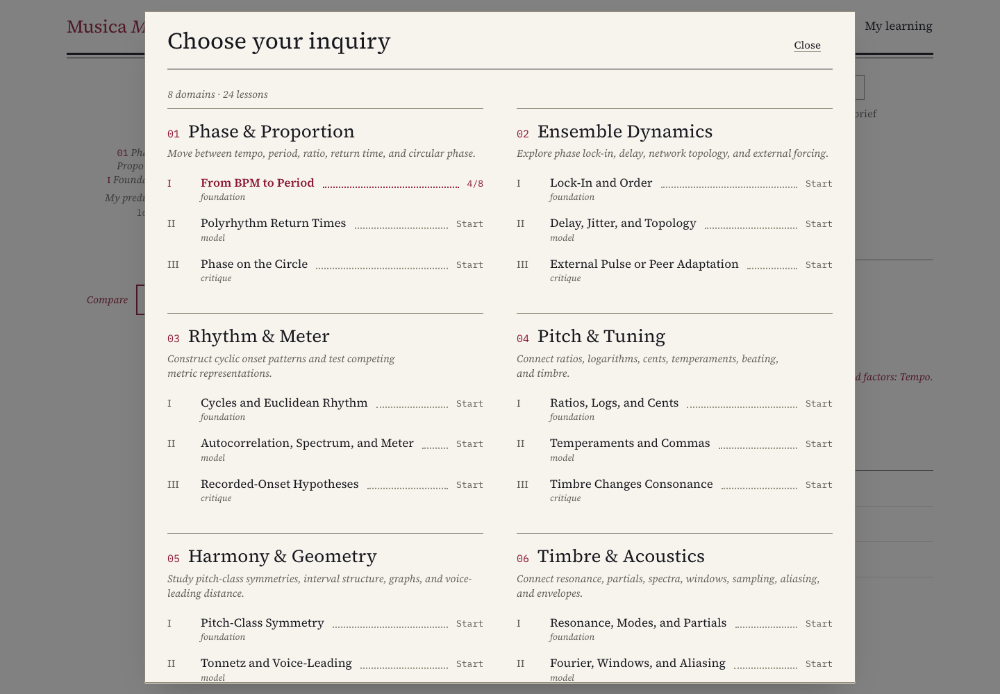

# Musica Mathematica

Explore the mathematics of music through 24 interactive lessons. Change a tempo,
compare tuning systems, build a rhythm, or test how a model ensemble responds
to delay. Make a prediction, change one factor, and compare what happens.

Musica Mathematica is designed for music students and teachers, with synthetic
examples in every lesson and optional microphone or audio-file analysis in
three lessons. It runs in your browser, without an account or backend. Your
learning record stays in that browser unless you export it.

This is an alpha teaching tool. Its results describe mathematical models and
uncalibrated audio observations; they do not grade musical performance.

[Run locally](#run-locally) · [Screenshot tour](#screenshot-tour) ·
[Pages demo](#github-pages-demo) · [Contribute](CONTRIBUTING.md)

## Screenshot tour

The tour uses the Pages demo with synthetic example data.

### 1. Start with a question

Each lesson starts with a musical question and a model to explore it.
Write a prediction before revealing the model results.



### 2. Change one thing

Record a baseline, then adjust a factor. Here, Run A uses 90 BPM and the
unrecorded preview uses 120 BPM. The beat period changes from about 0.667 to
0.500 seconds while beats per bar stays at four.



### 3. Compare and explain

The comparison keeps both recorded runs and their units visible. Continue
with an explanation, a listening or performance activity, and a reflection on
what the model can tell you.



### 4. Explore another idea

Open **Lessons** to browse all eight domains. **My learning** lets you return
to saved inquiries, export your portfolio, or switch to presentation mode.



## What you can explore

Each domain has a foundation lesson, a model lesson, and a critique lesson.

| Domain | Foundation | Model | Critique |
| --- | --- | --- | --- |
| Phase & Proportion | From BPM to Period | Polyrhythm Return Times | Phase on the Circle |
| Ensemble Dynamics | Lock-In and Order | Delay, Jitter, and Topology | External Pulse or Peer Adaptation |
| Rhythm & Meter | Cycles and Euclidean Rhythm | Autocorrelation, Spectrum, and Meter | Recorded-Onset Hypotheses |
| Pitch & Tuning | Ratios, Logs, and Cents | Temperaments and Commas | Timbre Changes Consonance |
| Harmony & Geometry | Pitch-Class Symmetry | Tonnetz and Voice-Leading | Chord Hypotheses |
| Timbre & Acoustics | Resonance, Modes, and Partials | Fourier, Windows, and Aliasing | Time-Varying Timbre |
| Probability & Form | Seeded Chance | Markov Memory | Entropy, Surprisal, and Form |
| Measurement & Inference | Provenance and Uncertainty | Recovering Parameters | Compare Without Grading |


The [curriculum guide](docs/MUSICA_MATHEMATICA_CURRICULUM.md) describes the
activities, prerequisites, and teaching limits. Every lesson follows eight
stages: orient, predict, experiment, compare, explain, perform, transfer, and
debrief.

## Run locally

Use Node.js `^20.19.0` or `>=22.12.0` and pnpm `11.6.0`.

```sh
git clone https://github.com/sebastianspicker/musica-mathematica.git
cd musica-mathematica
pnpm install --frozen-lockfile
pnpm dev
```

Open the address Vite prints, normally <http://127.0.0.1:5173/>.
No environment file, API key, database, or external service is needed.

To build for a static host at the origin root:

```sh
pnpm build
```

Serve the contents of `dist/` over HTTPS. Lesson URLs use fragments such as
`#/labs/phase-proportion/lessons/from-bpm-to-period`, so lesson navigation
does not need server-side route handling.

## GitHub Pages demo

The interactive demo is built for
[the project's Pages address](https://sebastianspicker.github.io/musica-mathematica/).
Publishing is manual. If the site is unavailable, use the local preview below
or follow the [deployment guide](docs/DEPLOYMENT.md).

The demo opens **From BPM to Period** with a prediction and two recorded runs
at 90 and 120 BPM. You can change factors, try other lessons, and reset the
example through **My learning**. The **Demo data · separate portfolio** label
identifies this mode. Demo changes use separate browser storage from ordinary
learner records.

Preview the demo locally:

```sh
pnpm build:pages
pnpm exec vite preview --host 127.0.0.1 --port 4175 --strictPort --mode pages
```

Open <http://127.0.0.1:4175/musica-mathematica/>.
See [deployment instructions](docs/DEPLOYMENT.md) for the manual Pages workflow
and instructions for forks.

## Your data and audio

The portfolio saves your predictions, notes, inputs, and results in browser
storage. It keeps up to 12 trials per lesson and 256 chart points per trial.
**My learning** offers JSON export and clearing. Export is download-only;
importing a portfolio is not supported. If saving fails, the app continues in
memory and displays a notice. Export before leaving to keep that work.

Recorded-Onset Hypotheses, Chord Hypotheses, and Time-Varying Timbre accept
optional microphone or file input. Audio is processed locally. Raw audio, file
names, and device identifiers are excluded from portfolio storage and export.

Microphone capture requires browser permission and a secure context, and lasts
5–20 seconds. Files must have an `audio/*` media type, be at most 25 MiB, and
decode to at most 90 seconds; an analysis selection can cover at most 30 seconds.
Codec support depends on the browser. See the [audio method](docs/LOCAL_AUDIO_METHOD.md)
for processing details and interpretation limits.

## Limits

- This is a teaching notebook, with no accounts, course administration,
  automatic grading, or remote collaboration.
- Audio estimates can be ambiguous or wrong. Pitch estimation is monophonic;
  dBFS is not sound pressure level, and chord labels are hypotheses.
- Automated browser tests cover Chromium, Firefox, and WebKit. They do not
  establish support for every browser version, codec, or microphone device.
- Formal accessibility conformance and classroom effectiveness have not been
  established.

The [scientific basis](docs/SCIENTIFIC_BASIS.md) explains how the models work
and how to interpret their results. See [release status](RELEASE_STATUS.md) for alpha support
and licensing limits.

## Development and documentation

```sh
pnpm verify
pnpm exec playwright install chromium firefox webkit
pnpm test:e2e
```

`pnpm verify` runs lint, unit tests, type-checking, and the production build.
The browser suite separately exercises root and Pages builds in all three
engines. [Contributing](CONTRIBUTING.md) covers focused checks and screenshot
capture.

- [Architecture](docs/ARCHITECTURE.md): module layout, runtime flows, storage,
  and browser audio.
- [Product guide](PRODUCT.md): audience, lesson workflow, and design choices.
- [Performance checks](docs/PERFORMANCE.md): workloads and benchmark commands.
- [Security policy](SECURITY.md): data handling and vulnerability reporting.
- [Changelog](CHANGELOG.md): user-visible changes.

## License

No project license has been selected; the package is marked `UNLICENSED`.
See [third-party notices](THIRD_PARTY_NOTICES.md) for dependency and font
attribution. The build includes these notices in `third-party-licenses.txt`.
