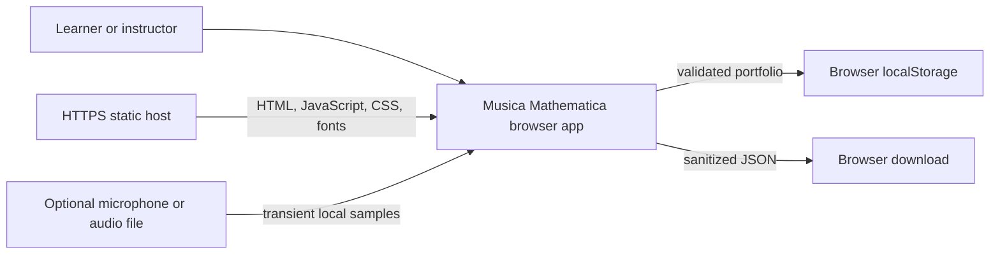
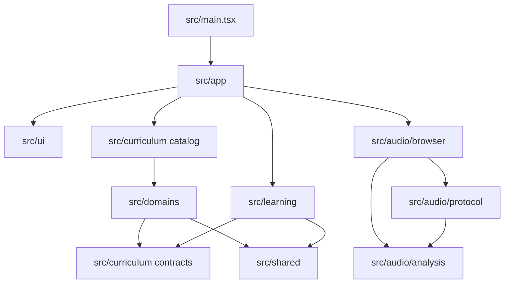
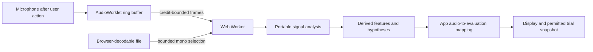

# Architecture

Musica Mathematica is a static React and Vite application. Lessons, learning
records, and optional audio analysis all run in the browser. The workers and
AudioWorklet are browser assets within the application bundle, not separate
services. The application has no server, accounts, database, remote storage,
analytics, or runtime API configuration.

## System context

The host serves the application files. Application code does not send portfolio
or audio data back to it. Portfolio export creates a local download, and the app
has no import or restore feature. The browser and operating system still control
media permissions and device access.

## Components and dependencies

An arrow means that the source may depend on the target. Import restrictions in
`eslint.config.mjs` enforce the lower-level boundaries and allow the one
intentional edge from the curriculum catalog to the domain modules.

| Area | Responsibility |
| --- | --- |
| `src/shared/` | Small browser-independent utilities, including numeric validation. |
| `src/curriculum/` | Shared lesson and evaluation contracts, registry validation, and catalog assembly. |
| `src/domains/` | Eight deterministic domains, each with three lessons and matching evaluators. |
| `src/learning/` | Inquiry stages, evidence, controlled comparison, portfolio schema, validation, migration, and storage ports. |
| `src/audio/analysis/` | Portable windowing, FFT-backed analysis, features, and ranked hypotheses. |
| `src/audio/protocol/` | Worker and AudioWorklet messages and bounded frame queues. |
| `src/audio/browser/` | Media capture, file decoding, workers, AudioWorklet integration, and resource cleanup. |
| `src/ui/` | Presentational React components driven by supplied state and callbacks. |
| `src/app/` | Browser composition, routes, controllers, storage and download adapters, and audio-to-lesson mapping. |

Domain logic, learning rules, and portable audio analysis do not use React, the
DOM, storage, Worker, AudioWorklet, or media APIs. Browser adapters live in
`src/app/` or `src/audio/browser/`. Stateful lesson coordination belongs in
`src/app/`, while reusable rendering belongs in `src/ui/`.

## Application and lesson flow

`index.html` loads `src/main.tsx`, which mounts `src/app/App.tsx` inside React
`StrictMode`. `App` resolves the hash route, selects the lesson, loads the
portfolio through an injected storage port, and composes the Lessons and My
learning dialogs with `LessonWorkbenchController`.

Lesson routes have the form `#/labs/<domain-id>/lessons/<lesson-id>`. When a
fragment does not identify a lesson, `App` replaces it with the current valid
route.

`LessonWorkbenchController` and `useLessonController` manage factor input,
evaluation, stage actions, playback, and optional audio requests. They pass a
view state to `src/ui/workbench/LessonWorkbench.tsx`. Numeric controls
can retain an invalid draft without passing it to a domain model, and native
form validation runs before a trial is recorded. A displayed audio observation
waits for current analysis instead of falling back to a synthetic result.

The workbench keeps an unrecorded preview separate from recorded evidence. A
learner must commit a prediction before experimenting, and comparison requires
two compatible trials. The ordered sequence of eight stages comes from
`src/learning/stages.ts`.

Playback advances with animation frames. Only the transport subscribes to
playhead updates, which are published at 10 Hz, with immediate notifications
when playback starts or stops. Stable memoized inputs keep playback from
recomputing unchanged charts, comparisons, and evidence. If lesson rendering
fails, its error boundary can retry with the default factors without discarding
saved attempts. `App` also manages focus after lesson and stage navigation;
native dialogs restore focus when dismissed with Escape.

`src/curriculum/catalog.ts` assembles the eight domains. The registry in
`src/curriculum/registry.ts` checks identifier uniqueness, exactly three lessons
per domain, evaluator coverage, factor definitions, and evaluator output. Each
domain maps its own lesson identifiers to evaluators, so there is no central
evaluator switch.

## Portfolio state and privacy

`src/learning/portfolio/` defines the version 2 records and the code that
validates, sanitizes, aggregates, and stores them through `StoragePort`. The
production browser implementation is `src/app/portfolio/browserStorage.ts`.

The normal portfolio key is `musicaMathematica.learning.v2`. When no valid
version 2 record exists, the repository can copy one valid
`ensembleCouplingLab.learning.v1` record into the corresponding Ensemble
Dynamics lesson. It leaves the legacy record in place. The `labId` field name,
both storage keys, the migration behavior, and the exported fields are
compatibility contracts.

Validation and sanitization run when records are loaded, saved, and exported.
Each lesson keeps its newest 12 trials. A trial keeps at most 256
endpoint-sampled trace points, 16 factors with required lesson factors first,
and 24 observables. Responses and notes are limited to 16,384 Unicode code
points. Observable values and provenance methods are limited to 1,024 code
points, extension factor keys and values to 512, and display labels and trace
series names to 256. Canonical identifiers are preserved.

A compact serialized portfolio may contain at most 4 MiB of UTF-8 JSON. To meet
that limit, compaction first reduces traces, then removes the oldest trials that
are not needed for the comparison stage, and finally removes the oldest
non-active attempts. It retains the active attempt and the two trials required
at comparison and later stages. The UI reports compaction and storage failures.
If stored JSON is larger than 8 MiB, the app leaves the original value untouched,
disables automatic persistence, and displays recovery guidance.

Portfolio records never contain raw audio, encoded files, file names, media
streams, object URLs, or device identifiers.

The GitHub Pages build injects the adapter in `src/app/demo/`. It creates a
schema-valid 90 to 120 BPM comparison with the production evaluator and stores
it under `musicaMathematica.demo.learning.v2`. The adapter hides both normal and
legacy keys. Reading, editing, or resetting the demo therefore cannot read,
migrate, overwrite, or clear a learner's normal portfolio.

## Local audio flow

A microphone capture lasts from 5 through 20 seconds. An audio file must have
an `audio/*` media type, occupy no more than 25 MiB, and decode to no more than
90 seconds. The selected range may be at most 30 seconds. Analysis uses frames
of 2,048 or 4,096 samples with 50% overlap. Credits on the worklet connection
and a bounded worker queue prevent an unlimited backlog. The provenance
dropped-frame total covers stale frames, overflow, and sequence gaps, while the
expensive analysis stays off the UI thread.

Only Recorded-Onset Hypotheses can save an audio-derived controlled-comparison
snapshot. Chord Hypotheses and Time-Varying Timbre show audio results as an
additional observation; their controlled portfolio trials remain synthetic.
The [audio guide](LOCAL_AUDIO_METHOD.md) describes the algorithms, cleanup,
privacy rules, and limits on interpretation.

## Builds and deployment

`pnpm build` type-checks the application and writes an origin-root bundle to
`dist/`. `pnpm build:pages` runs Vite in `pages` mode, sets the base to
`/musica-mathematica/`, rewrites the favicon path, makes application, worker,
worklet, and font assets aware of that base, and enables isolated demo storage.

On pushes and pull requests, CI installs the frozen lockfile with Node 22 and
runs `pnpm verify`. The GitHub Pages workflow is manual and builds, uploads, and
deploys the Pages artifact. Repository settings, the live origin, response
headers, and cache behavior remain part of the deployment environment.
`index.html` includes a same-origin meta Content Security Policy, with loopback
WebSocket access for Vite development. A deployed host should also send
appropriate security headers.

## Stable contracts and extension points

Changes to the following values need focused tests and an explicit compatibility
or migration decision:

- route, domain, lesson, protocol, claim, factor, and input-mode identifiers;
- `LessonDefinition`, `EvaluationOutput`, storage keys, portfolio version 2,
  trial and trace caps, export fields, and legacy migration behavior;
- audio frame sizes, input limits, queue capacity, and worker and AudioWorklet
  messages; and
- the origin-root and project-subpath asset assumptions of the two build modes.

Add a lesson in its domain's `lessons.ts`, add its evaluator to `evaluators.ts`,
and update the domain's public `index.ts`. Add a domain through
`src/curriculum/catalog.ts`. New storage, media, or download behavior belongs
behind a port or browser adapter rather than in domain or learning code.

## What local verification covers

Tests are colocated under `src/**/*.test.{js,ts,tsx}` and run in Vitest's Node
environment. `pnpm verify` runs lint, unit tests, type-checking through the
build, and the origin-root production build. The tests also check asset URLs
in the Pages build. `pnpm test:e2e` separately runs the root and Pages builds
through Chromium, Firefox, and WebKit, covering lesson completion, navigation,
storage, playback, and analysis of generated audio files.

Local automated checks cannot establish browser permission behavior, microphone
hardware behavior, codec availability, applied media constraints, deployed
response headers, or the state of the live Pages site. The application also does
not provide accounts, remote storage, course authoring, LMS integration,
grading, calibrated measurement, complete transcription, or validated
assessment. [Scientific Basis](SCIENTIFIC_BASIS.md) explains how its outputs
should be interpreted.
